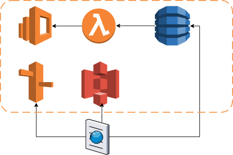

# discounts-aws




## Create Dynamodb Table
* Create new Dynamodb table.
* Since table is partitioned by primary key in dynamodb. 
And secondary index should be used to access the table by other columns. Secondary index is infact another copy of the source table's required/projected columns and is expensive in terms of storage. For this use case i decided to use id (user generated key as there is no auto generated column in this db)

## Create Elasticsearch index

* Define index, mention data types so the elasticsearch does not index non text columns (optimize space & search)

```json
curl -X PUT http://search-discounts-b66mp2j5op2utko2iueei4rod4.eu-west-1.es.amazonaws.com/discounts?pretty -H "Content-Type: application/json" -d '
{
  "mappings": {
    "discount": {
      "properties": {
        "stDate": {
          "type": "date"
        },
        "endDate": {
          "type": "date"
        },
        "ttl": {
          "type": "long"
        },
        "id": {
          "type": "text",
          "index": false
        },
        "img": {
          "type": "text",
          "index": false
        },
        "oldPrice": {
          "type": "long"
        },
        "price": {
          "type": "long"
        }
      }
    }
  }
}
'
```

## Create lambda trigger
Create lambda trigger for populating elasticsearch index on changes in the dynamodb table.
* Go to dynamodb table -> Enable Stream. 
New image is enough for our app and this will also save stream bandwidth as lambda's batch processing capacity is limited.
* Go to dynamodb table -> Triggers
* Create New function
* Use the python code provided in this repo to update elasticsearch index. (discounts-update-handler.py)
* Use elasticsearch's bulk api to index/delete all updates/adds/deletes of the dynamodb table in one request. 


## Create Identity Pool
Identity pools is the preferred auth mechanism instead of exposing the aws access id in a client side application.

* Go to AWS Console -> Cognito -> Manage Federated Identities -> Create new pool.
* Select a name for the pool e.g. DiscountsIdentityPool.
* Enable unauthenticated access, since there is no login/signup required in our app and everything is public.
* Create the pool
* In the same identity pool's dashboard->sample code view the AWS credentials to be used in your javascript app e.g. in this repo, angular controller initialization in assets/js/discounts.js has:

```javascript
// Initialize the Amazon Cognito credentials provider
AWS.config.region = 'eu-west-1'; // Region
AWS.config.credentials = new AWS.CognitoIdentityCredentials({
    IdentityPoolId: 'eu-west-1:38109516-e327-4f69-89b9-d70281bc0589',
});
```

* Set permissions (follow steps below) for the unauthenticated users in this pool. Note that we do not need to provide authenticated role as it is a public site.

## Create Policy & Role for public app users
The public users will need an IAM role to access the site. Create a policy and a role for this purpose.

* Go to IAM -> Policy -> Create Policy
* Use Policy Generator
* Select allow
* Select AWS Dynamodb as AWS Service
* Select Query, GetItem in Actions
* Provide ARN of the previously created Dynamodb table.
* Got to IAM -> Role -> Create Role
* Choose a web identity role
* Choose Amazon Cognito as identity provider
* Provide Identity pool name from above
* Provide the policy name created above for permissions
* Use this role in the identity pool unauthenticated role config.

## Prepare javascript sdk
## Query elasticsearch using public api
## Host angular app on s3 (static website)


